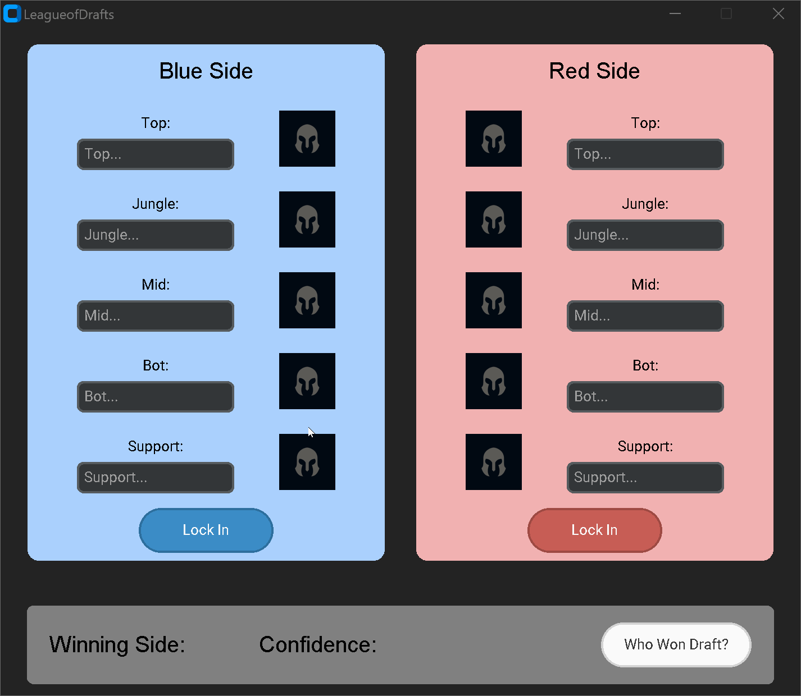
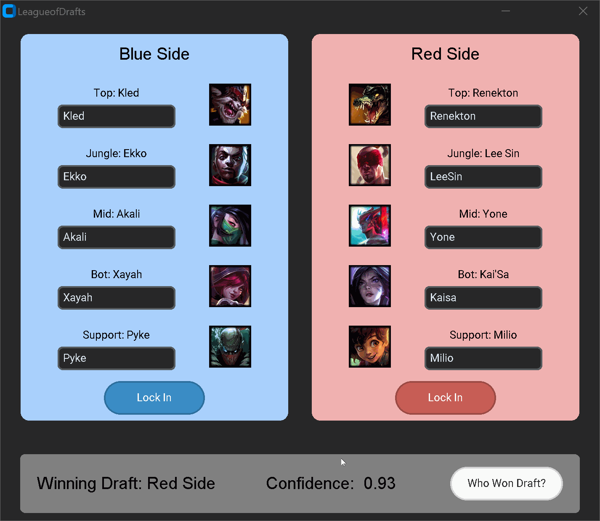

# LeagueofDrafts
League of Legends is a pretty popular MOBA and I play it occassionally, mainly with my friends. We get into arguments about which champions to play to create an inherent advantage before the game starts. This is what many people call "winning the draft". Winning a League game requires more than just the better draft of course, but the better draft tends to make winning the game easier and allows for more leeway given a disparity in skill. How would I know who won draft? There's no better way than a trained model to give me an accurate predictor on who really won. Given evenly matched opponents, which team chose the better champions? Trained off a dataset of 20000+ matches from the top 150+ players on the ladder, the model will give a more accurate answer than the average player eye-balling or feeling it out.

<h4>Happy Drafting!</h4>

## Demo
Simple run through with a draft:


<br></br>

Changing some champs in some of the positions:


<br></br>

Misspelling a champ or not filling in the entire team comp:


## Environment Setup
Make sure you have the correct dependencies if you are running the script:
```
pip install tensorflow
pip install numpy
pip install pandas
pip install -U scikit-learn
pip install requests
pip install customtkinkter
```

## Running application

Running the application is simple. To run locally, make sure you have the repository cloned and you want to open a command prompt. Double check to make sure you have the riot version of python (3.9+) and the dependencies installed. You want to `cd` into the repository folder. From there, all you need to do is 
```
python draft_winner.py
```
and the program should open.
<br></br>
On a side note, I have also packaged the entire thing into an executable that is too big for GitHub so if you like the program and don't want to open a command prompt everytime you want to see which team's draft is better, feel free to email me, youe@wustl.edu, asking for the executable and I will deliver.

## Data
The model is trained on information gathered using RIOT API on patch 13.13. In the `get_match_data.py` script, it first gathers the top 155 players on the NA leaderboard. With every player, the details of each of their last 97 games is recorded. The five picks for blue side, five picks for red side, and the winner of the game are then written as a single data point and added to the `matches` spreadsheet in the `match_data` folder. The numbers are like and not even multiples of 100 because RIOT API only allows 100 API calls every two minutes and other operations are done before getting game information so it works out to these numbers.

If you want to train your own model on more updated data, feel free to run the `get_match_data.py` script:
```
python get_match_data.py
```
This will update the `matches` spreadsheet with the new data.

## Model
The model is a predictive Tensorflow Keras sequential model. 
- The first (input) layer is a Dense layer with 32 neurons and uses the Rectified Linear Unit (ReLU) activation function. ReLU returns the value if it is positive and zero if it is negative so it limits outputs to values greater than zero. The input dimension for this layer is determined by the number of columns in the training data which is 11 coming from our five blue picks, five red picks, and one winning side.
- The hidden layers are Dense layers with 64 units each and ReLU activation functions. These hidden layers help the model learn complex patterns and representations from the input data.
- The final layer is a Dense layer with 1 unit, using the Sigmoid activation function. The Sigmoid activation function maps the output to a probability between 0 and 1, indicating likelihood.
- The loss function is binary cross-entropy as this is a binary classification task.
- The optimizer is Adam which is an optimization algorithm that adapts the learning rates for each parameter during training.
- The model's performance is evaluated using accuracy, which measures the proportion of correctly predicted samples.

In the `model.fit` step, there are two parameters: `epochs` and `batch_size`. Feel free to play around and change the numbers to your liking, but be careful in choosing numbers that are too high in which the model might be overfit to the data and not actually perform well on new data.

